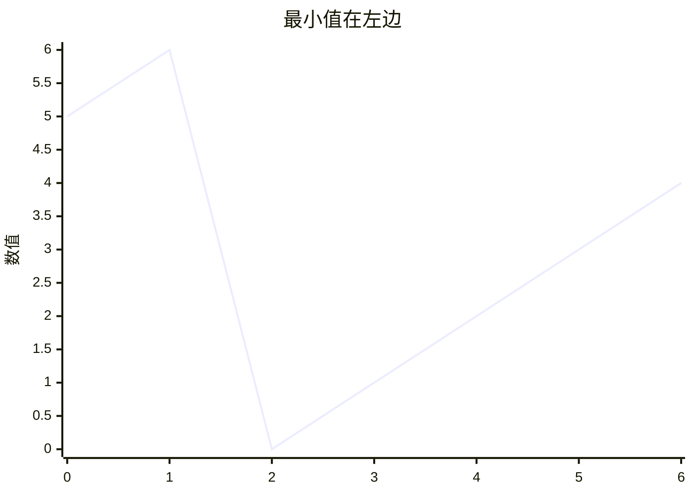
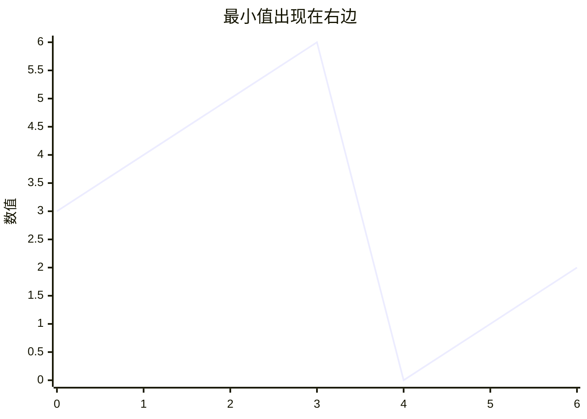
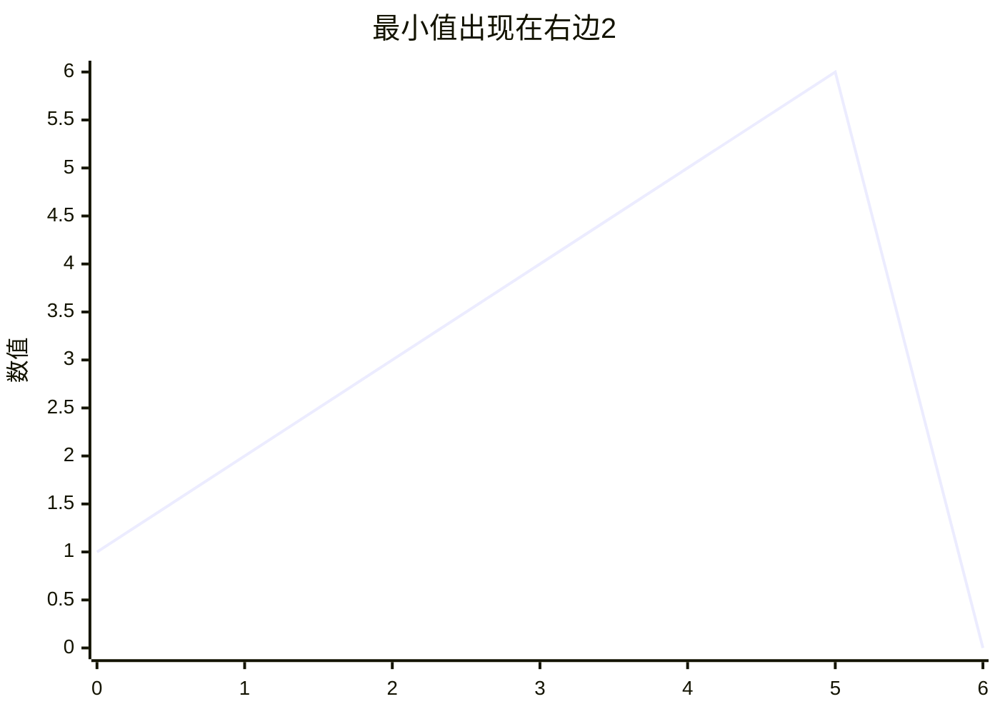
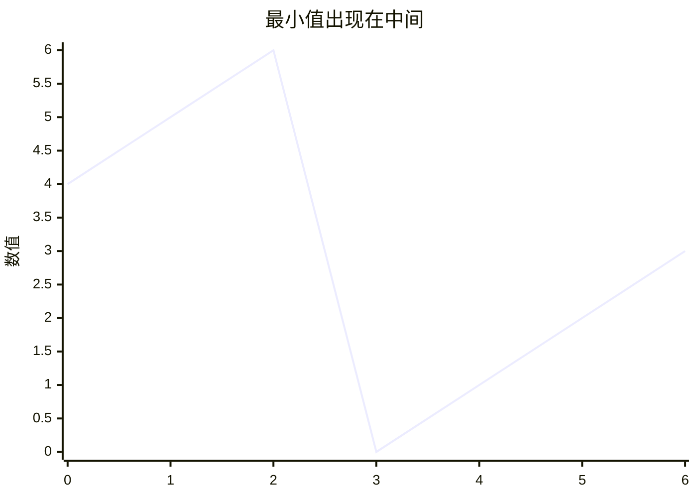

# 题目[153. 寻找旋转排序数组中的最小值](https://leetcode.cn/problems/find-minimum-in-rotated-sorted-array/description/?envType=study-plan-v2&envId=top-100-liked)

已知一个长度为 n 的数组，预先按照升序排列，经由 1 到 n 次 旋转 后，得到输入数组。例如，原数组 nums = [0,1,2,4,5,6,7] 在变化后可能得到：
若旋转 4 次，则可以得到 [4,5,6,7,0,1,2]
若旋转 7 次，则可以得到 [0,1,2,4,5,6,7]
注意，数组 [a[0], a[1], a[2], ..., a[n-1]] 旋转一次 的结果为数组 [a[n-1], a[0], a[1], a[2], ..., a[n-2]] 。

给你一个元素值 互不相同 的数组 nums ，它原来是一个升序排列的数组，并按上述情形进行了多次旋转。请你找出并返回数组中的 最小元素 。

你必须设计一个时间复杂度为 O(log n) 的算法解决此问题。

 

示例 1：

    输入：nums = [3,4,5,1,2]
    输出：1
    解释：原数组为 [1,2,3,4,5] ，旋转 3 次得到输入数组。

示例 2：

    输入：nums = [4,5,6,7,0,1,2]
    输出：0
    解释：原数组为 [0,1,2,4,5,6,7] ，旋转 4 次得到输入数组。

示例 3：

    输入：nums = [11,13,15,17]
    输出：11
    解释：原数组为 [11,13,15,17] ，旋转 4 次得到输入数组。
 

提示：

    n == nums.length
    1 <= n <= 5000
    -5000 <= nums[i] <= 5000
    nums 中的所有整数 互不相同
    nums 原来是一个升序排序的数组，并进行了 1 至 n 次旋转

*****

# 解题思路

说实话，没看懂他的旋转是什么意思，但是看例子，能知道，这个列表正常情况下是两个递增数组拼接起来，极端情况下是一个递增数组

题目说要logN的时间复杂度，不好意思我是瞎子，我没看到


## 解法1 暴力&用库:

### golang代码1

O（n）的时间复杂度我最会了[doge]

```go
func findMin(nums []int) int {
    minNum := nums[0]
    for i := range nums{
        if nums[i] < minNum{
            minNum = nums[i]
        }
    }
    return minNum
}
```

运行结果
```
执行用时分布
0ms 击败100.00%

消耗内存分布
4.15MB 击败68.50%
```

### python代码1

python这边偷懒，直接调用库函数[doge]

```python
class Solution:
    def findMin(self, nums: List[int]) -> int:
        return min(nums)

```

运行结果
```
执行用时分布
0ms 击败100.00%

消耗内存分布
17.30MB 击败95.58%
```

我靠，库函数就是牛逼。

### rust代码1

最近一个项目用到了rust，又要成为继python，和golang之后，要熟练掌握的第三门语言了，后序我也会把之前做的题目加上rust的版本（2025.12.26）

今天看了一天的rust，发现大部分地方还是和golang以及python这些相似的，但是rust有自己的特点，这里就不啰嗦了，大家感兴趣的话，可以自己去学习一下，感觉还是挺有意思的一门语言的（效率号称是c/c++这种级别的）
```rust
impl Solution {
    pub fn find_min(nums: Vec<i32>) -> i32 {
        let mut min_num = nums[0];
        for each in &nums{
            if *each < min_num{
                min_num = *each
            }
        }
        min_num
    }
}
```

运行结果
```
执行用时分布
0ms 击败100.00%

消耗内存分布
2.25MB 击败46.67%
```

## 解法2 递归&二分搜索:

写上面的解法，面试官肯定想扇你，所以我们还是要准备准备按流程走

根据题目意思，那这个最低值，肯定是出现在列表的值突然降低的时候（因为是两个递增列表），最特殊的情况就是一个递增列表

这里其实有个特性，下面用例子说明

假如case为 0,1,2,3,4,5,6

```mermaid
xychart
    title "正常列表"
    x-axis [0,1,2,3,4,5,6]
    y-axis "数值" 0 --> 6
    line [0,1,2,3,4,5,6]
```

这里的中位是下标3（左边0，1，2，右边4，5，6）

如果这个列表旋转，那他一共几种可能呢

下面l代表下标0，m代表中间，r代表最右边

1.最小值出现在左边


那就能发现: `nums[m] < nums[r] < nums[l]`

那如果没旋转，那`nums[l] < nums[m] < nums[r]`


2.最小值出现在右边




那就能发现: `nums[r] < nums[l] < nums[m]`


3.最小值出现在中间


那就能发现: `nums[m] < nums[r] < nums[l]`


总结一下：

最小在左边的时候有

    nums[l] < nums[m] < nums[r]

    nums[m] < nums[r] < nums[l]

最小在右边的时候有

    nums[r] < nums[l] < nums[m]

最小正好在中间的时候有

    nums[m] < nums[r] < nums[l]


简化一下上面逻辑，可以发现

    当nums[m]大于nums[r]时，最小值一定在右边,并且当前m一定不是最小点，其他case都当做是在左边即可

所以有如下代码

### golang代码
```go
func findMin(nums []int) int {
    m := len(nums)/2
    r := len(nums) - 1
    if nums[m] > nums[r] {
        // 对应上面m大于r时，最小值一定在右边，并且不是当前m，所以m+1
        return findMin(nums[m+1:])
    }else {
        // 不然就取左边
        return findMin(nums[:m+1])
    }
}
```
上面这个代码会超时，因为没有处理好边界条件，但是我脑子不够用了，打算偷懒一下

边界条件无非就是当nums比较小的时候(当长度<3的时候)，上面的代码没法处理，所以我们把比较小的时候的case加上[doge]
```go
func findMin(nums []int) int {
    // 边界条件1 当nums只有1个数
    if len(nums) == 1{
        return nums[0]
    }
    // 边界条件2 当nums有2个数
    if len(nums) == 2{
        if nums[0] > nums[1]{
            return nums[1]
        }
        return nums[0]
    }
    m := len(nums)/2
    r := len(nums) - 1
    if nums[m] > nums[r] {
        return findMin(nums[m+1:])
    }else {
        return findMin(nums[:m+1])
    }
}
```

运行结果
```
执行用时分布
0ms 击败100.00%

消耗内存分布
4.16MB 击败52.20%
```

### python代码

照旧翻译为python
```python
class Solution:
    def findMin(self, nums: List[int]) -> int:
        if len(nums) == 1: return nums[0]
        if len(nums) == 2: return nums[0] if nums[0] < nums[1] else nums[1]
        m = len(nums)//2
        r = len(nums) - 1
        if nums[m]>nums[r]:
            return self.findMin(nums[m+1:])
        else:
            return self.findMin(nums[:m+1])
        
```

运行结果
```
执行用时分布
0ms 击败100.00%

消耗内存分布
17.05MB 击败99.51%
```

### rust代码

来了，没怎么写过rust，在gpt的帮助下写完

```rust
impl Solution {
    pub fn find_min(nums: Vec<i32>) -> i32 {
        Self::find_min_slice(&nums)
    }

    fn find_min_slice(nums: &[i32]) -> i32{
        let n = nums.len();
        if n == 1{
            return nums[0];
        }
        if n == 2{
            return if nums[0] < nums[1] {nums[0]} else {nums[1]};
        }
        let m = n / 2;
        let r = n - 1;
        if nums[m] > nums[r] {
            Self::find_min_slice(&nums[m+1..])
        } else {
            Self::find_min_slice(&nums[..=m])
        }
    }
}
```

运行结果
```
执行用时分布
0ms 击败100.00%

消耗内存分布
2.15MB 击败86.67%
```

## 解法3 二分搜索

上面这个二分搜索看起来确实不太优雅

我们已经知道了，当中间节点大于右边节点的时候，最小值一定在右边，那我们其实只要在nums上面移动指针就行了，也不用递归了

### golang代码
```go
func findMin(nums []int) int {
    left := 0
    right := len(nums) - 1
    for left < right {
        middle := (left + right ) / 2
        if nums[middle] > nums[right] {
            // 灵魂+1 :D
            left = middle + 1
        } else {
            right = middle
        }
    }
    // 这个时候左右相等，取哪个都可以
    return nums[left]
}
```

运行结果
```
执行用时分布
0ms 击败100.00%

消耗内存分布
4.28MB 击败5.04%
```

### python代码

```python
class Solution:
    def findMin(self, nums: List[int]) -> int:
        left = 0
        right = len(nums) - 1
        while left < right:
            middle = (left + right) // 2
            if nums[middle] > nums[right]:
                left = middle + 1
            else:
                right = middle
        return nums[left]

```

运行结果
```
执行用时分布
0ms 击败100.00%

消耗内存分布
17.22MB 击败95.32%
```

### rust代码

```rust
impl Solution {
    pub fn find_min(nums: Vec<i32>) -> i32 {
        # mut声明可变变量
        let mut left = 0;
        let mut right = nums.len() - 1;
        while left < right{
            let middle = (left + right) / 2;
            if nums[middle] > nums[right] {
                left = middle + 1;
            } else {
                right = middle;
            }
        }
        nums[left]
    }
}
```
运行结果
```
执行用时分布
0ms 击败100.00%

消耗内存分布
2.27MB 击败32.79%
```

欢迎来github上看更多题目的解答[力扣解题思路](https://github.com/WRAllen/LeetCode)
